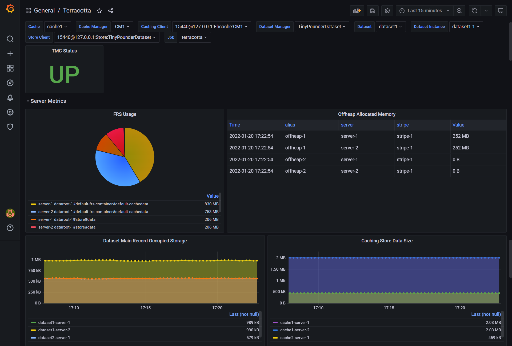
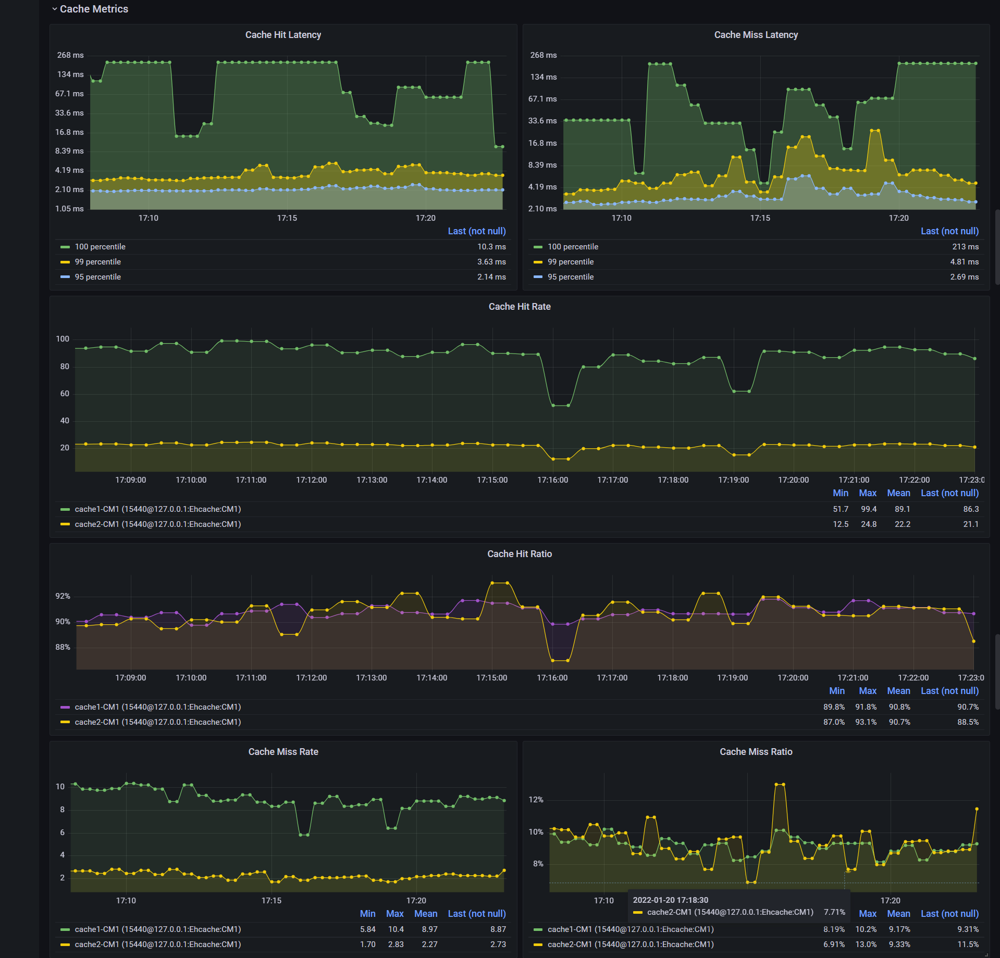
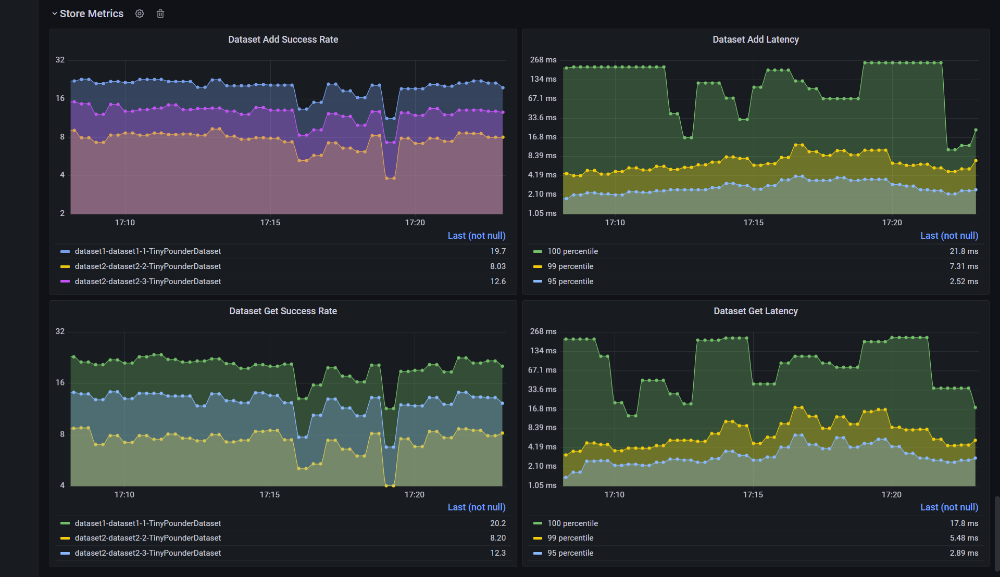

## About

Terracotta provides a list of key metrics in Prometheus compatible format over HTTP on the TMS (Terracotta Management Server) endpoint. Once you have deployed Prometheus, you can use [Grafana dashboards](https://grafana.com/docs/grafana/latest/dashboards/) for data visualizations and monitoring. To get started you can import the dashboard provided in this sample.

## Directory Structure

- [dashboard](./dashboard) - contains the dashboard file (JSON format).
- [images](./images) - contains dashboard screenshots with sample data.

## Dashboard

It contains following 3 rows:
- **Server Metrics** - contains server-side statistics.

   
   
- **Cache Metrics** - contains Ehcache statistics.

   

- **Store Metrics** - contains statistics for TCStore dataset operations.

   
