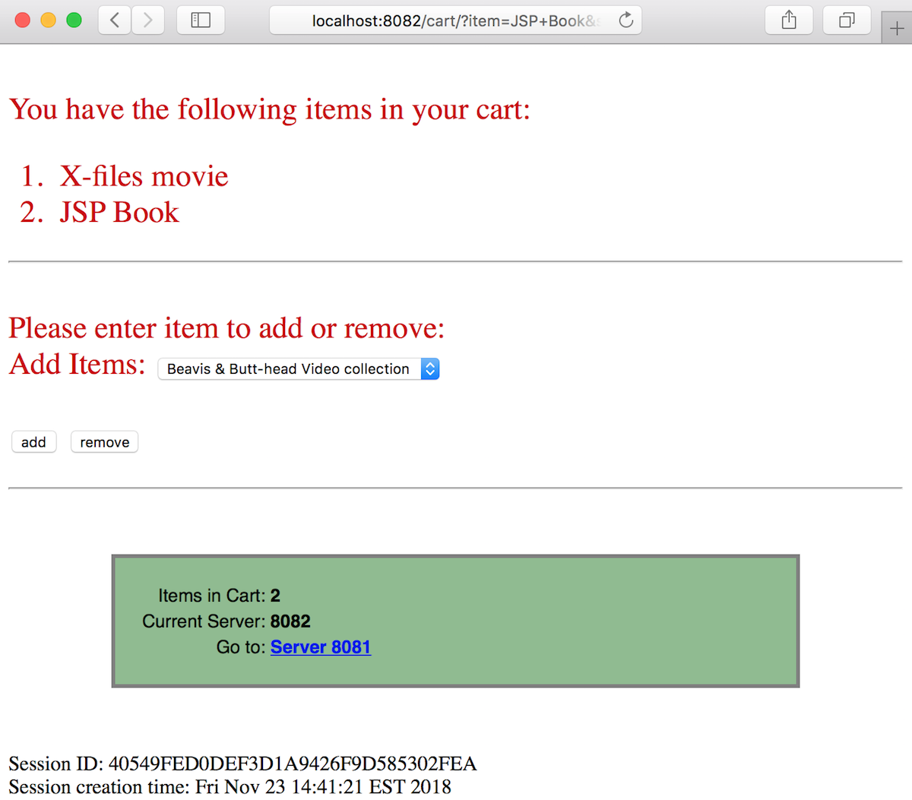

# Websessions cart sample

The cart sample is a jsp/servlet cart webapp to demo Terracotta DB Websessions product.

Have a look at the code
-----------------------
The Java source code is located under [src](src/)

Important note
--------------
Make sure you read and applied the instructions provided [at the top level](../../../)

Once you've set the TC_HOME, you'll also need to set the version (TC_VERSION) of Terracotta DB.

For example :

    export TC_VERSION=10.4.0.1.43
    export TC_HOME=/Users/anthony/terracotta-db

or on Windows :

    set TC_VERSION=10.4.0-SNAPSHOT
    set TC_HOME=C:\Users\IEUser\terracotta-db-10.4.0.0.143

How to Run
----------

1. Start a server by running

        ./start-server.(bat|sh)

2. Configure the cluster by running

        ./configure-cluster.(bat|sh)

3. Connect a Websessions client to the server by running

        ./start-websessions-8081.(bat|sh)

It should now be listening to port 8081

4. Connect another Websessions client to the server by running

        ./start-websessions-8082.(bat|sh)

It should now be listening to port 8081

You can now add elements to the cart, and switching from 8081 to 8082, you'll keep on using the same user session.

Keep in mind the session timeout is 1 mn by default (you can change that in the web.xml)

    <session-timeout>2</session-timeout>
